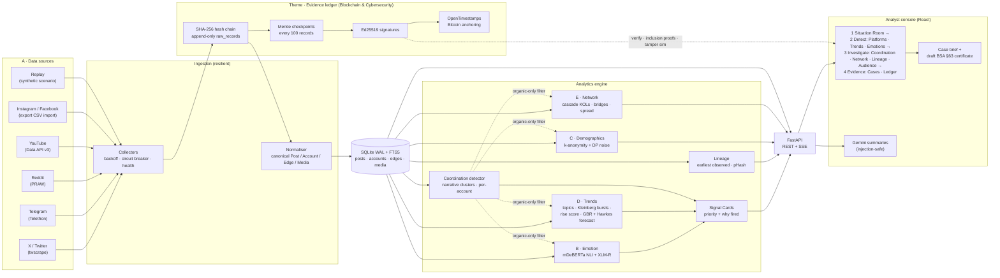
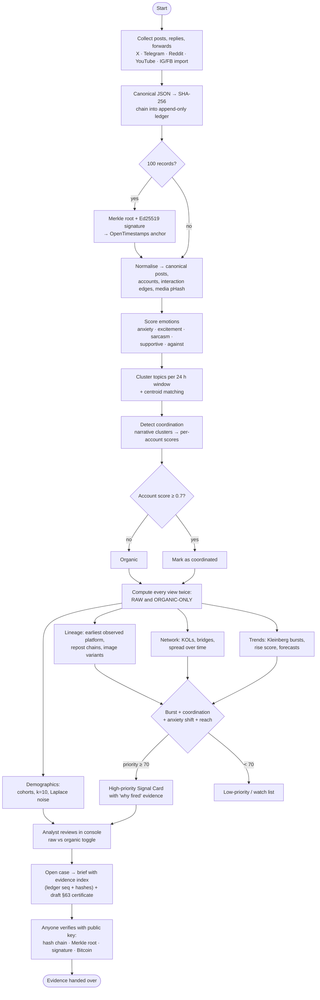
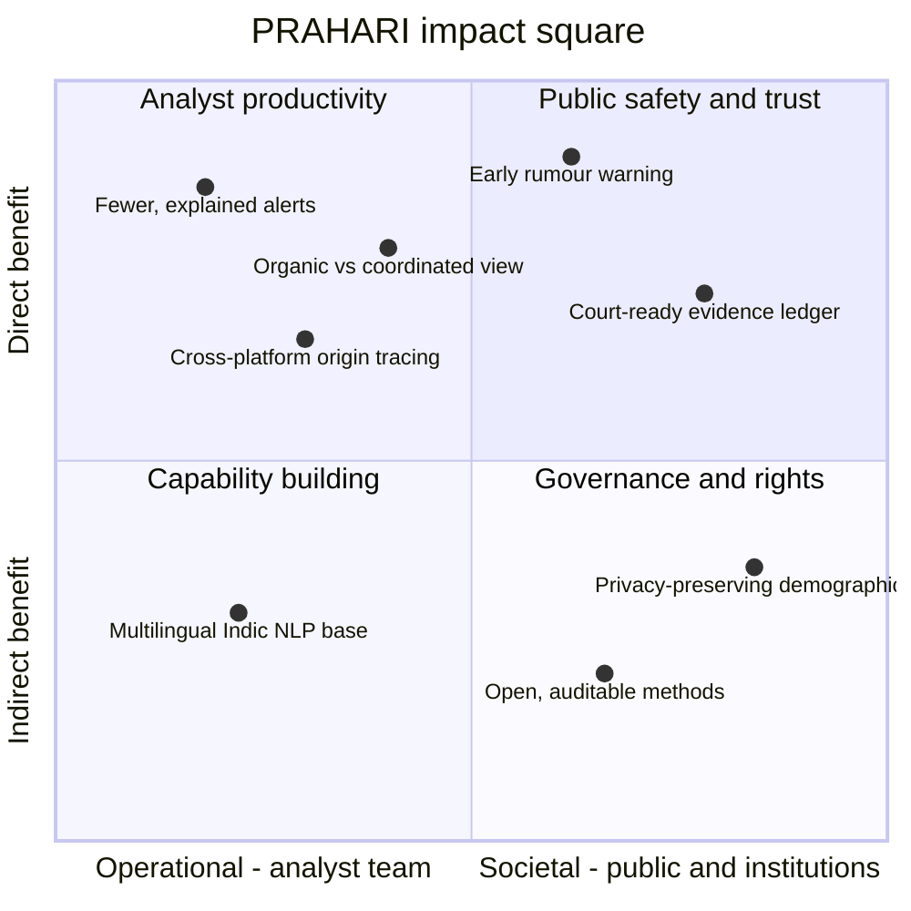
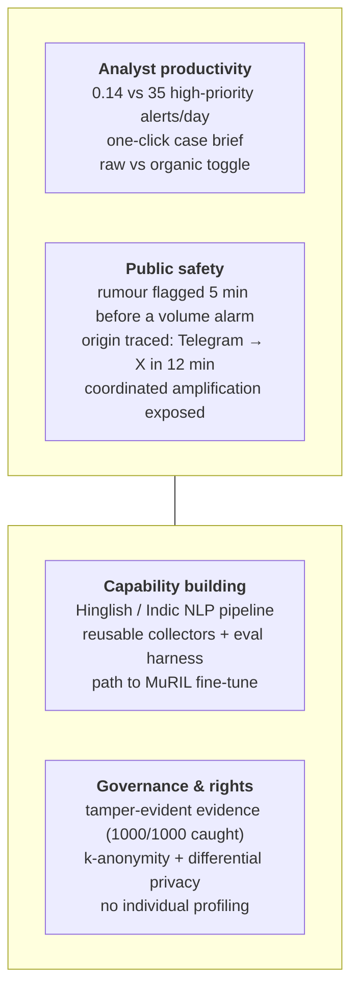

# PRAHARI: diagrams (Mermaid) and references

Paste each block into https://mermaid.live (or any Mermaid renderer) to export PNG/SVG for slides.

---

## 1. System architecture

---

## 2. Workflow diagram

---

## 3. Impact square

Qualitative positioning of what PRAHARI changes, by who benefits (x-axis) and how
direct the effect is (y-axis). Placement is a judgement, not a measurement; the
measured numbers are in `eval/reports/summary.json`.

Alternative 2×2 box version (if your slide template needs text boxes):

---

## 4. References (plain text, with links for verification)

Algorithms and methods
1. J. Kleinberg, "Bursty and Hierarchical Structure in Streams," Proc. ACM SIGKDD, 2002. https://doi.org/10.1145/775047.775061
2. K.-I. Goh and A.-L. Barabási, "Burstiness and memory in complex systems," EPL 81, 48002, 2008. https://doi.org/10.1209/0295-5075/81/48002 (preprint: https://arxiv.org/abs/physics/0610233)
3. A. G. Hawkes, "Spectra of some self-exciting and mutually exciting point processes," Biometrika 58(1), 83–90, 1971. https://doi.org/10.1093/biomet/58.1.83
4. D. Pacheco et al., "Uncovering Coordinated Networks on Social Media: Methods and Case Studies," ICWSM 2021. https://doi.org/10.1609/icwsm.v15i1.18075
5. F. B. Keller, D. Schoch, S. Stier, J. Yang, "Political Astroturfing on Twitter: How to Coordinate a Disinformation Campaign," Political Communication 37(2), 2020. https://doi.org/10.1080/10584609.2019.1661888
6. L. Page, S. Brin, R. Motwani, T. Winograd, "The PageRank Citation Ranking: Bringing Order to the Web," Stanford InfoLab, 1999. http://ilpubs.stanford.edu:8090/422/
7. U. Brandes, "A faster algorithm for betweenness centrality," Journal of Mathematical Sociology 25(2), 2001. https://doi.org/10.1080/0022250X.2001.9990249
8. A. Clauset, M. E. J. Newman, C. Moore, "Finding community structure in very large networks," Physical Review E 70, 066111, 2004. https://doi.org/10.1103/PhysRevE.70.066111
9. C. Zauner, "Implementation and Benchmarking of Perceptual Image Hash Functions," MSc thesis, 2010. https://www.phash.org/docs/pubs/thesis_zauner.pdf

NLP models
10. P. He, J. Gao, W. Chen, "DeBERTaV3: Improving DeBERTa using ELECTRA-Style Pre-Training with Gradient-Disentangled Embedding Sharing," 2021. https://arxiv.org/abs/2111.09543 — model used: https://huggingface.co/MoritzLaurer/mDeBERTa-v3-base-mnli-xnli
11. A. Conneau et al., "XNLI: Evaluating Cross-lingual Sentence Representations," EMNLP 2018. https://arxiv.org/abs/1809.05053
12. W. Yin, J. Hay, D. Roth, "Benchmarking Zero-shot Text Classification: Datasets, Evaluation and Entailment Approach," EMNLP 2019. https://arxiv.org/abs/1909.00161
13. A. Conneau et al., "Unsupervised Cross-lingual Representation Learning at Scale" (XLM-R), ACL 2020. https://arxiv.org/abs/1911.02116
14. F. Barbieri, L. Espinosa Anke, J. Camacho-Collados, "XLM-T: Multilingual Language Models in Twitter for Sentiment Analysis and Beyond," LREC 2022. https://arxiv.org/abs/2104.12250 — model used: https://huggingface.co/cardiffnlp/twitter-xlm-roberta-base-sentiment
15. N. Reimers, I. Gurevych, "Sentence-BERT," EMNLP 2019. https://arxiv.org/abs/1908.10084
16. N. Reimers, I. Gurevych, "Making Monolingual Sentence Embeddings Multilingual using Knowledge Distillation," EMNLP 2020. https://arxiv.org/abs/2004.09813 — model used: https://huggingface.co/sentence-transformers/paraphrase-multilingual-MiniLM-L12-v2
17. S. Khanuja et al., "MuRIL: Multilingual Representations for Indian Languages," 2021 (planned fine-tune). https://arxiv.org/abs/2103.10730

Cryptography, evidence and privacy
18. R. C. Merkle, "A Digital Signature Based on a Conventional Encryption Function," CRYPTO '87. https://doi.org/10.1007/3-540-48184-2_32
19. D. J. Bernstein et al., "High-speed high-security signatures" (Ed25519), Journal of Cryptographic Engineering, 2012. https://doi.org/10.1007/s13389-012-0027-1
20. S. Josefsson, I. Liusvaara, "Edwards-Curve Digital Signature Algorithm (EdDSA)," RFC 8032, 2017. https://www.rfc-editor.org/rfc/rfc8032
21. A. Rundgren, B. Jordan, S. Erdtman, "JSON Canonicalization Scheme (JCS)," RFC 8785, 2020. https://www.rfc-editor.org/rfc/rfc8785
22. OpenTimestamps (Bitcoin-anchored timestamping). https://opentimestamps.org
23. L. Sweeney, "k-anonymity: A model for protecting privacy," Int. J. Uncertainty, Fuzziness and Knowledge-Based Systems 10(5), 2002. https://doi.org/10.1142/S0218488502001648
24. C. Dwork, F. McSherry, K. Nissim, A. Smith, "Calibrating Noise to Sensitivity in Private Data Analysis," TCC 2006. https://doi.org/10.1007/11681878_14
25. Bharatiya Sakshya Adhiniyam, 2023 (Act No. 47 of 2023), Section 63 — electronic records. Official text: India Code, https://www.indiacode.nic.in (search "Bharatiya Sakshya Adhiniyam").

Software
26. F. Pedregosa et al., "Scikit-learn: Machine Learning in Python," JMLR 12, 2011. https://jmlr.org/papers/v12/pedregosa11a.html
27. A. Hagberg, D. Schult, P. Swart, "Exploring Network Structure, Dynamics, and Function using NetworkX," SciPy 2008. https://conference.scipy.org/proceedings/SciPy2008/paper_2/
28. Hugging Face Transformers (T. Wolf et al., EMNLP 2020 demos). https://arxiv.org/abs/1910.03771
